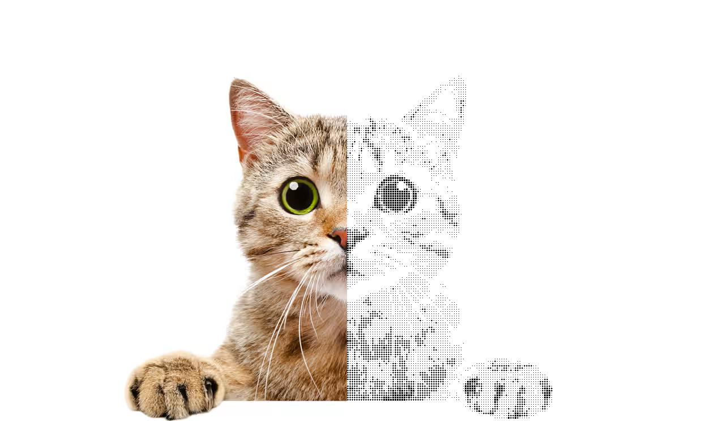
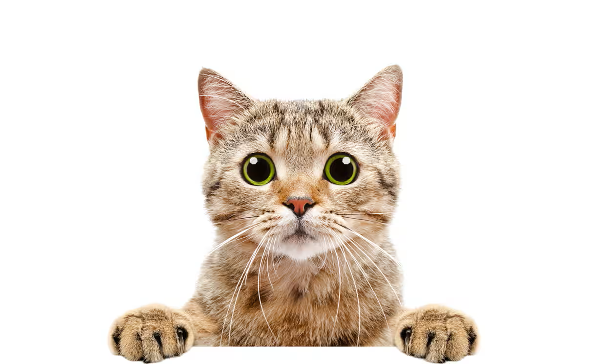
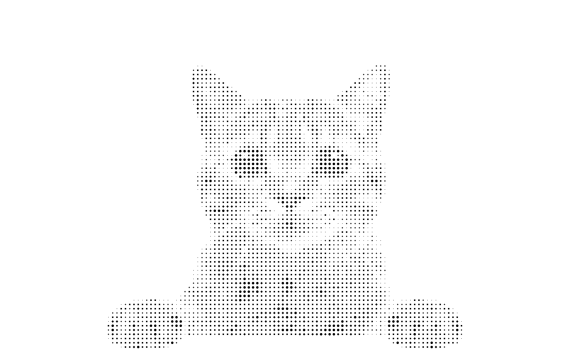
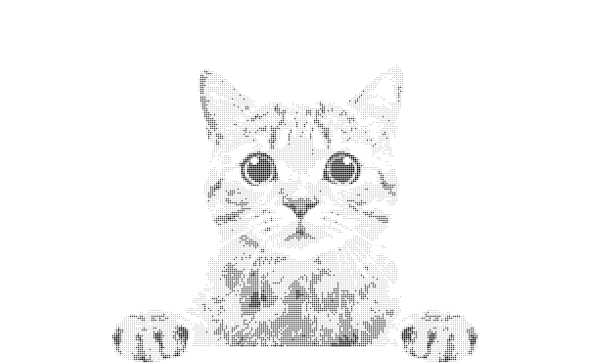
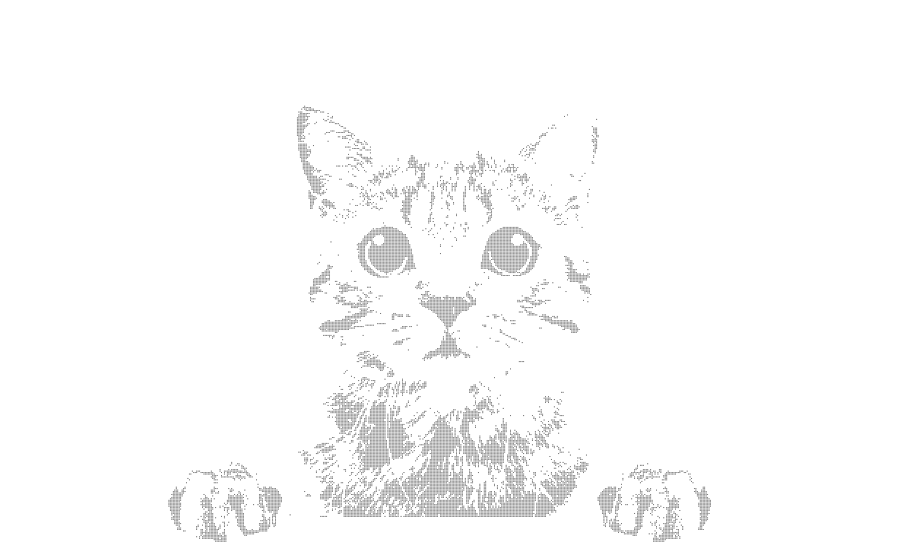

# printing-press-image-converter
Convert any provided image to a version that could have been printed on a printing press in an old newspaper



## Usage

```
go run ./src/main.go <fidelity> <input/file.png> <output/file.png>
```

## Example

__Input__



__Output: Fidelity 80__

`go run ./src/main.go 80 ./assets/input.png ./assets/output_80.png`



__Output: Fidelity 180__

`go run ./src/main.go 180 ./assets/input.png ./assets/output_180.png`



__Output: Fidelity 280__

`go run ./src/main.go 280 ./assets/input.png ./assets/output_280.png`



Higher fidelity results in lower contrast. So the optimal fidelity depends on the image